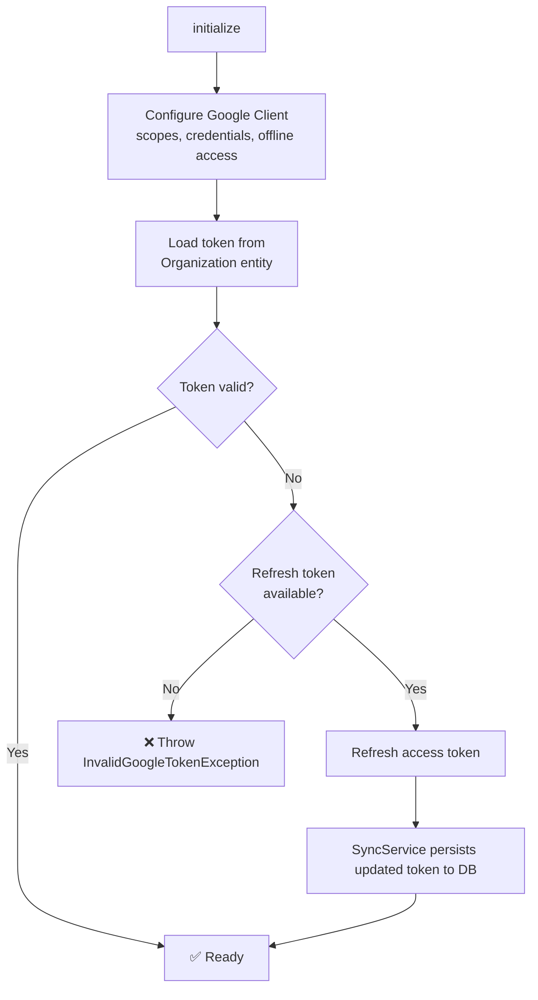

# 🔑 Google Client (`App\Client\Google`)

This namespace contains the Google Workspace integration layer, communicating with the [Google Admin Directory API](https://developers.google.com/admin-sdk/directory) to manage Google Group memberships.

## 🔄 OAuth Lifecycle

`GoogleClient::initialize()` handles the full OAuth lifecycle and must be called before any read/write operations:

The two required scopes are `ADMIN_DIRECTORY_GROUP` and `ADMIN_DIRECTORY_GROUP_MEMBER`. Access type is set to `offline` so that a refresh token is issued on initial authorization. The `select_account` consent prompt ensures the refresh token is always included.

## 🏭 GoogleClientFactory

`GoogleClientFactory` builds a `GoogleClient` from an `Organization` entity. It reads the decrypted `googleOAuthCredentials` and `googleToken` fields (the `EncryptedFieldListener` has already decrypted them by the time the factory reads them) and configures the Google API client accordingly.

## 💾 Token Storage

The OAuth token is stored as encrypted JSON in `Organization::googleToken`. There are two ways to provision it:

- **Web OAuth redirect flow** — `SettingsController::googleConnect` redirects the user to Google's consent screen; `SettingsController::googleCallback` exchanges the authorization code for a token and persists it to the `Organization` entity.
- **CLI paste flow** — `sync:configure` prompts the user to visit a URL, paste the authorization code, and stores the token. This is primarily useful during initial setup before the web UI is available.

If the token is refreshed during a sync (because the access token expired), `SyncService` detects the change and persists the updated token back to the `Organization` entity.

## ⚠️ Installed vs. Web Credentials

The Google Cloud Console offers "Desktop app" (`installed`) and "Web application" (`web`) credential types. The `SettingsController` handles both transparently — if it detects `installed`-type credentials, it converts them to `web`-style with the correct redirect URI before initiating the OAuth flow.

For production use with the web UI, "Web application" credentials with the correct redirect URI (`https://your-domain.com/settings/google/callback`) are recommended.