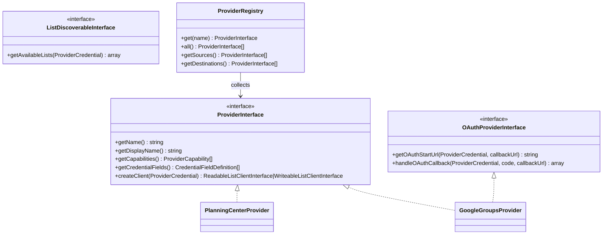

# Provider Abstraction Layer

The `App\Client\Provider` namespace defines the extensible provider framework that allows any external service to act as a sync source, destination, or both.

## Architecture



## Core Concepts

### ProviderInterface

Every provider must implement `ProviderInterface`:

- **`getName()`** — unique machine name (e.g. `planning_center`, `google_groups`)
- **`getDisplayName()`** — human-readable label for the UI
- **`getCapabilities()`** — array of `ProviderCapability` enum values (`Source`, `Destination`, or both)
- **`getCredentialFields()`** — array of `CredentialFieldDefinition` objects describing the fields needed for this provider's credentials (used to dynamically build forms)
- **`createClient(ProviderCredential)`** — factory method that builds a `ReadableListClientInterface` or `WriteableListClientInterface` from the credential's stored data

### ProviderCapability

An enum with two cases: `Source` and `Destination`. A provider can support one or both capabilities.

### CredentialFieldDefinition

A value object describing a single credential field: name, label, type, whether it's required, whether it contains sensitive data, help text, and placeholder text. The `ProviderCredentialType` form uses these definitions to dynamically build the credential editing form.

### ProviderRegistry

A service that collects all tagged providers (`#[AutoconfigureTag('app.provider')]`) via Symfony's `#[AutowireIterator]`. Provides lookup by name and filtered lists of source/destination providers.

## Optional Interfaces

### OAuthProviderInterface

For providers that require OAuth authentication (e.g. Google Groups):

- **`getOAuthStartUrl()`** — returns the URL to redirect the user to for OAuth consent
- **`handleOAuthCallback()`** — exchanges the authorization code for tokens and returns the updated credentials array

### ListDiscoverableInterface

For providers that can enumerate their available lists. Not currently implemented by any built-in provider but available for future use.

## Adding a New Provider

1. Create a new class implementing `ProviderInterface` (and optionally `OAuthProviderInterface` or `ListDiscoverableInterface`).
2. Tag it with `#[AutoconfigureTag('app.provider')]`.
3. Implement `getCredentialFields()` to describe the fields needed.
4. Implement `createClient()` to build a `ReadableListClientInterface` and/or `WriteableListClientInterface`.
5. The provider will be automatically discovered by `ProviderRegistry` and available in the UI.

Example skeleton:

```php
#[AutoconfigureTag('app.provider')]
class MyProvider implements ProviderInterface
{
    public function getName(): string { return 'my_provider'; }
    public function getDisplayName(): string { return 'My Provider'; }
    public function getCapabilities(): array { return [ProviderCapability::Source]; }

    public function getCredentialFields(): array
    {
        return [
            new CredentialFieldDefinition('api_key', 'API Key', required: true, sensitive: true),
        ];
    }

    public function createClient(ProviderCredential $credential): ReadableListClientInterface
    {
        $creds = $credential->getCredentialsArray();
        return new MyClient($creds['api_key']);
    }
}
```
