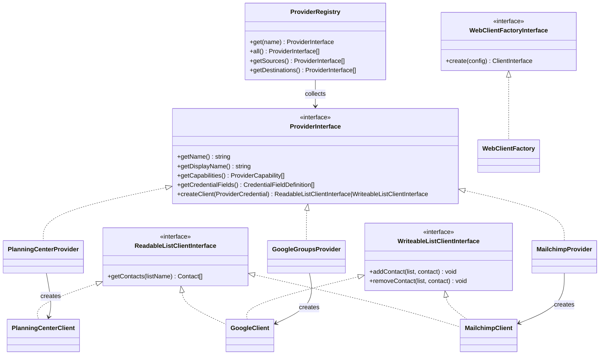

# Client Namespace

The `App\Client` namespace defines the contracts and shared infrastructure for communicating with external list providers. Individual API implementations live in sub-namespaces. The `Provider` sub-namespace contains the extensible provider framework.

## Design

Two interfaces separate read and write concerns: `ReadableListClientInterface` for fetching contacts from a list, and `WriteableListClientInterface` for modifying list membership. `GoogleClient`, `PlanningCenterClient`, and `MailchimpClient` implement the readable interface. `GoogleClient` and `MailchimpClient` implement the writeable interface, making Mailchimp the first provider supporting both source and destination roles.

**Provider layer** — Each provider wraps a client factory and implements `ProviderInterface`. The `ProviderRegistry` collects all tagged providers and is the single entry point for `SyncService` to obtain API clients. See the [Provider README](Provider/README.md) for details on the abstraction layer and how to add new providers.

`WebClientFactory` provides a factory abstraction over Guzzle HTTP clients so that API clients can receive pre-configured HTTP clients without directly instantiating them — primarily to simplify testing. `PlanningCenterClient` and `MailchimpClient` use this factory; `GoogleClient` does not because the Google SDK manages its own HTTP transport.
