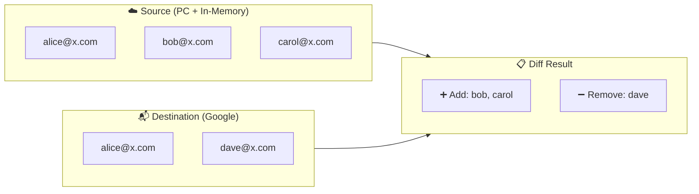

# 📊 Contact Namespace

The `App\Contact` namespace contains the domain model for contacts and the logic used to compare contact lists during a sync.

## ContactListAnalyzer

Computes the diff between a **source** list (Planning Center + in-memory contacts) and a **destination** list (Google Group). The diff determines which contacts need to be added to or removed from the destination.

### Algorithm

The analyzer performs a bidirectional comparison keyed on **lowercased email address**:

1. ➕ **Contacts to add** — present in the source list but missing from the destination list.
2. ➖ **Contacts to remove** — present in the destination list but missing from the source list.

Each direction is computed by `buildDiffArray()`, which indexes the comparison list into a hash map by lowercased email, then filters the reference list to find emails absent from that map. When `$removeDuplicates` is `true` (the default), duplicate emails within a single list are collapsed so each address appears at most once in the result.

### Example

