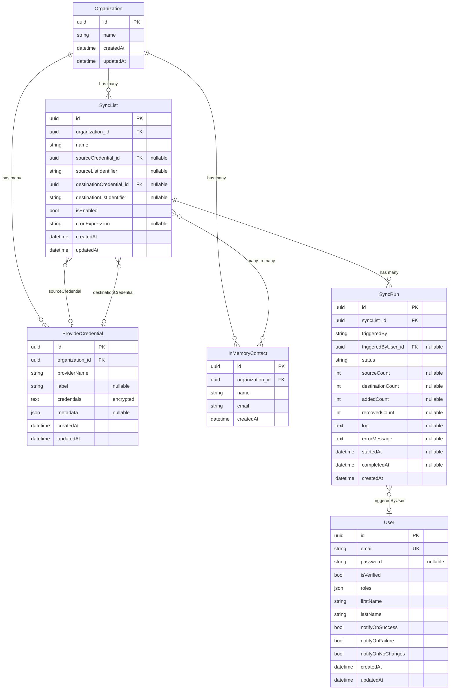

# Entities

## Overview

### Organization
The top-level tenant. All sync configuration — lists, credentials, and in-memory contacts — is scoped to an Organization. Deleting an Organization cascade-removes all of its owned entities.

### User
An authenticated application user. Users log in via email/password, have role-based access (`roles` JSON column), and configure per-user notification preferences that control which sync outcomes (success, failure, no changes) trigger email alerts. Users are independent of Organization — they are not scoped to a single tenant.

### ProviderCredential
Stores the credentials needed to connect to an external provider (e.g., Google, Planning Center). The `providerName` identifies the provider type, and the `credentials` column holds encrypted JSON (OAuth tokens, API keys, etc.) via the `#[Encrypted]` attribute. An optional `metadata` JSON column stores provider-specific state such as token expiry. Each credential belongs to one Organization and can be referenced by multiple SyncLists as either a source or destination.

### SyncList
Defines a single sync job: pull contacts from a source and push them to a destination. Each endpoint is configured via a nullable reference to a ProviderCredential plus a list identifier string (e.g., a Google contact group resource name or a Planning Center list ID). SyncLists can be enabled/disabled and optionally carry a cron expression for scheduled execution via Symfony Scheduler.

### SyncRun
An immutable record of a single sync execution for a SyncList. Tracks status (`pending`, `running`, `completed`, `failed`), contact counts (source, destination, added, removed), timing (startedAt/completedAt), and any error message or log output. Optionally references the User who triggered the run.

### InMemoryContact
A contact that exists only in the database, not sourced from an external provider. Belongs to an Organization and is associated with SyncLists via a many-to-many join table (`in_memory_contact_sync_list`), allowing the same contact to participate in multiple sync jobs as a source.

## Entity Relationship Diagram

