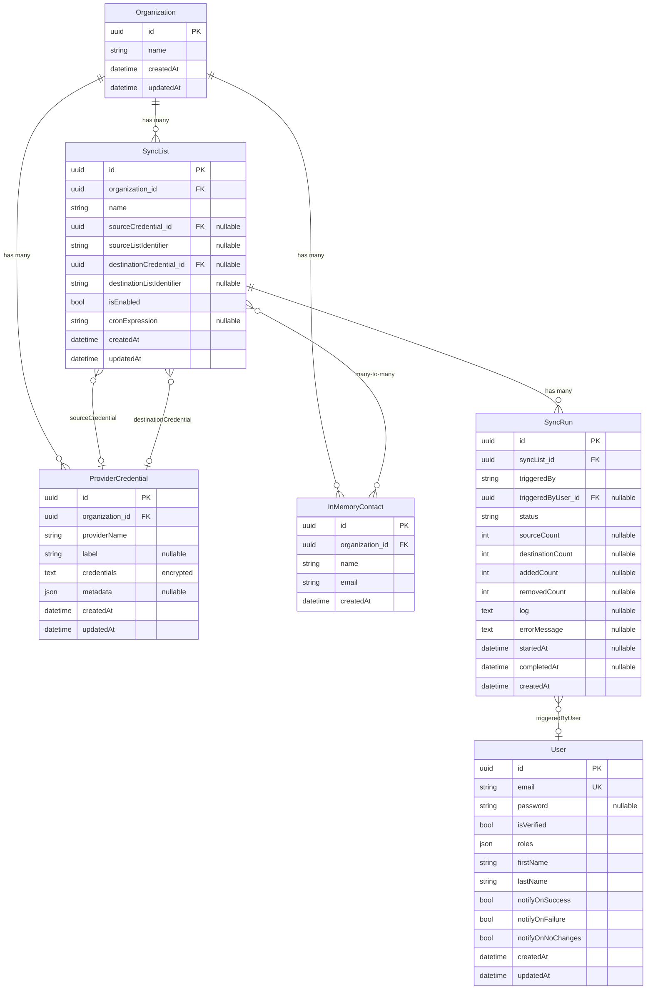

# Entity Relationship Diagram

## Relationships

- **Organization** is the top-level tenant. It owns SyncLists, ProviderCredentials, and InMemoryContacts (all cascade-removed with orphan removal).
- **SyncList** defines a sync job between a source and destination provider. Each endpoint is configured via a nullable reference to a **ProviderCredential** plus a list identifier string.
- **SyncRun** records the outcome of a single sync execution for a SyncList. It optionally tracks which **User** triggered it.
- **ProviderCredential** stores encrypted API credentials (OAuth tokens, API keys) for a given provider (e.g., Google, Planning Center).
- **InMemoryContact** represents a contact that exists only in the database (not from an external provider). It belongs to an Organization and is associated with SyncLists via a many-to-many join table (`in_memory_contact_sync_list`).
- **User** is independent of Organization and represents an authenticated application user with notification preferences.
