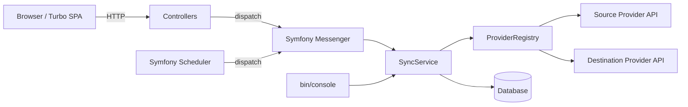
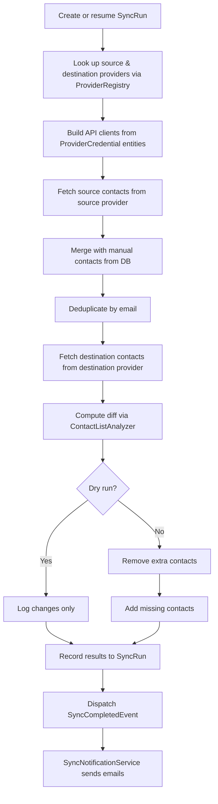

# Source Code — Technical Overview

This document covers the architecture, internal design, and developer workflow for the Contacts Sync application. For installation, configuration, and usage instructions, see the [project README](../README.md).

## Architecture



The application is a Symfony 7.2 web application with a Turbo + Stimulus SPA-like UI. It syncs contacts from a configurable source provider to a configurable destination provider by following a **source → diff → destination** pipeline:

1. Source contacts are read from the source provider (e.g. Planning Center) and merged with manual contacts stored in the database.
2. The merged list is compared against the current members of the destination (e.g. a Google Group).
3. The diff is applied to bring the destination in sync with the source.

Syncs can be triggered three ways: manually from the web UI, on a cron schedule via Symfony Scheduler, or from the CLI via `bin/console sync:run`. In all cases, the core logic lives in `SyncService`.

## Namespaces

| Namespace | Description | Details |
|-----------|-------------|---------|
| `App\Attribute` | Custom PHP attributes (`#[Encrypted]` marker for Doctrine field encryption) | — |
| `App\Client` | API client interfaces and implementations for reading/writing contact lists | [Client README](Client/README.md) |
| `App\Client\Provider` | Provider abstraction layer (registry, interfaces, capability enum) | [Provider README](Client/Provider/README.md) |
| `App\Client\Google` | Google Workspace Directory API integration (OAuth, token management, group membership) | [Google README](Client/Google/README.md) |
| `App\Client\PlanningCenter` | Planning Center People API integration (list lookup, pagination, email resolution) | [PlanningCenter README](Client/PlanningCenter/README.md) |
| `App\Command` | Symfony console commands (sync, setup wizard, user management, config migration, key rotation) | [Command README](Command/README.md) |
| `App\Contact` | Contact domain model, list diffing, and manual contact management | [Contact README](Contact/README.md) |
| `App\Controller` | Symfony web controllers (dashboard, CRUD, settings, auth, sync triggers, credential management) | — |
| `App\Entity` | Doctrine ORM entities (`User`, `Organization`, `SyncList`, `SyncRun`, `ManualContact`, `ProviderCredential`) | — |
| `App\Event` | Domain events dispatched during sync execution | — |
| `App\EventListener` | Doctrine listeners for field encryption and scheduler cache invalidation | — |
| `App\File` | File I/O abstraction used by the Google client | — |
| `App\Form` | Symfony form types for all CRUD, settings, and credential forms | — |
| `App\Message` | Messenger message DTOs (`SyncMessage`, `RefreshListMessage`) | — |
| `App\MessageHandler` | Async message handlers that invoke `SyncService` and source providers | — |
| `App\Notification` | Email notifications triggered by sync completion events | — |
| `App\Repository` | Doctrine repositories with custom query methods | — |
| `App\Scheduler` | Symfony Scheduler provider that builds a schedule from `SyncList` cron expressions | — |
| `App\Security` | Encryption service, user checker, and invitation email service | [Security README](Security/README.md) |
| `App\Sync` | Core sync orchestration (`SyncService`, `SyncResult`) | [Sync README](Sync/README.md) |
| `App\Validator` | Custom validation constraints (cron expression validation) | — |

## Sync Pipeline

Whether triggered via web UI, CLI, or scheduler, every sync follows the same path through `SyncService::executeSync()`:



Key details:

- **Provider Registry** (`ProviderRegistry`) discovers all providers tagged with `#[AutoconfigureTag('app.provider')]`. Each `SyncList` references a source and destination `ProviderCredential`, which links to a specific provider and stores the credentials needed to build an API client.
- **Client creation** — Providers implement `createClient(ProviderCredential)` to build the appropriate API client from the credential's encrypted JSON blob. The `#[Encrypted]` fields are transparently decrypted by Doctrine's `EncryptedFieldListener`.
- **Token refresh** — OAuth-based providers (like Google Groups) handle token refresh during client creation. If the token is refreshed, the updated credentials are persisted via the entity manager.
- **SyncRun audit log** — Every execution creates a `SyncRun` record tracking status, counts, timing, log output, and who triggered it.
- **Event-driven notifications** — `SyncCompletedEvent` is dispatched after every sync (success or failure). `SyncNotificationService` listens and sends emails to users based on their notification preferences.

## Data Model

```
Organization (single-tenant, one row)
├── name
├── ── ProviderCredential[]
│      ├── providerName (e.g. "planning_center", "google_groups")
│      ├── label (display name)
│      ├── credentials [encrypted JSON blob]
│      ├── metadata [JSON, nullable]
│      └── createdAt / updatedAt
├── ── SyncList[]
│      ├── name (display label)
│      ├── sourceCredential → ProviderCredential
│      ├── sourceListIdentifier (string)
│      ├── destinationCredential → ProviderCredential
│      ├── destinationListIdentifier (string)
│      ├── isEnabled
│      ├── cronExpression (nullable)
│      ├── ── SyncRun[]
│      └── ── ManualContact[] (many-to-many)
└── ── ManualContact[]
       ├── name
       ├── email
       └── ── SyncList[] (many-to-many)

User
├── email (login identifier)
├── password (nullable — null until invitation completed)
├── isVerified
├── roles [ROLE_USER, ROLE_ADMIN]
├── notifyOnSuccess / notifyOnFailure / notifyOnNoChanges
```

Sensitive fields on `ProviderCredential` are marked with `#[Encrypted]` and automatically encrypted/decrypted by `EncryptedFieldListener` using libsodium (XSalsa20-Poly1305). See the [Security README](Security/README.md) for details on encryption and key rotation.

## Dependency Injection

The Symfony service container uses autowiring. Key bindings in `config/services.yaml`:

| Constructor Parameter | Source |
|-----------------------|--------|
| `$encryptionKey` | `%env(APP_ENCRYPTION_KEY)%` |
| `$previousEncryptionKeys` | `%env(default::APP_PREVIOUS_ENCRYPTION_KEYS)%` |
| `$varPath` | `%kernel.var_dir%` |

Provider credentials and sync configuration are stored in the database and accessed through `ProviderCredential` and `SyncList` entities. Providers are auto-discovered via the `app.provider` tag. The `PlanningCenterClient` and `GoogleClient` classes are excluded from autowiring and created by their respective providers.

## Async Processing

Sync and refresh operations dispatched from the web UI go through Symfony Messenger:

1. **Controller** creates a `SyncRun` with status `pending`, dispatches a `SyncMessage` to the async transport, and redirects immediately.
2. **Worker** (`messenger:consume async scheduler_sync`) picks up the message, calls `SyncService::executeSync()`, and the run transitions through `running` → `success`/`failed`.
3. **Scheduler** reads `SyncList` cron expressions via `SyncScheduleProvider` and dispatches `SyncMessage` on schedule.

The `ScheduleCacheInvalidator` Doctrine listener clears the scheduler cache whenever a `SyncList` is created, updated, or deleted, so schedule changes take effect without restarting the worker.

## Project Structure

```
src/
├── Attribute/           # #[Encrypted] marker attribute
├── Client/              # API clients and provider framework
│   ├── Provider/        # Provider abstraction (registry, interfaces)
│   ├── Google/          # Google Groups provider
│   └── PlanningCenter/  # Planning Center provider
├── Command/             # CLI commands
├── Contact/             # Contact DTO and diff algorithm
├── Controller/          # Web controllers
├── Entity/              # Doctrine entities
├── Event/               # Domain events
├── EventListener/       # Doctrine listeners (encryption, cache invalidation)
├── File/                # Filesystem abstraction
├── Form/                # Symfony form types
├── Message/             # Messenger message DTOs
├── MessageHandler/      # Async message handlers
├── Notification/        # Email notification service
├── Repository/          # Doctrine repositories
├── Scheduler/           # Symfony Scheduler provider
├── Security/            # Encryption, user checker, invitations
├── Sync/                # Core sync service and result DTO
├── Validator/           # Custom validation constraints
└── Kernel.php
tests/                   # PHPUnit + Mockery tests (mirrors src/ structure)
config/                  # Symfony configuration
templates/               # Twig templates (Turbo + Tailwind)
migrations/              # Doctrine migrations
assets/                  # Stimulus controllers and JS entry point
```

## Developer Guide

### Prerequisites

- PHP 8.5+ with `sodium`, `intl`, and either `pdo_pgsql` or `pdo_mysql` extension
- [Composer](https://getcomposer.org/)
- PostgreSQL 16+ or MySQL 8.0+

### Running Tests

```bash
composer run-script test
```

Tests mirror the `src/` directory structure under `tests/`. They use Mockery for mocking and PHPUnit 13 as the test runner.

### Code Style

```bash
# Check for violations
composer run-script cs

# Auto-fix violations
composer run-script cs-fix
```

Always run both tests and code style after any change:

```bash
composer run-script test && composer run-script cs
```
